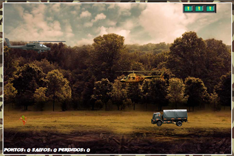
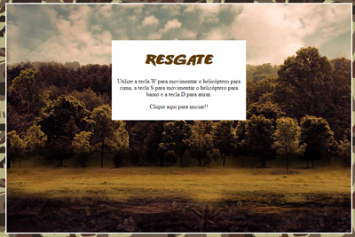

<h1 align="center"><a href="https://web.dio.me">Digital Innovation One</a></h1>

## Exercicios 
#### 👨‍💻 Scripts e exercicios da trilha Take Blip Web Development. Utilizando:

- [HTML](https://www.w3schools.com/html/)
- [CSS](https://developer.mozilla.org/pt-BR/docs/Web/CSS)
- [JavaScript](https://developer.mozilla.org/en-US/docs/Web/JavaScript)
- [jQuery](https://jquery.com/)

Tools: VSCode

### Atividade: Resgate Game

- Criando um jogo simples de resgaste. 

  

### Atividade: Netflix Web Page

- Clone responsivo da home page da Netflix com carrousel em jQuery.

  
  

  
  
  

### Atividade: Light Mode/Dark Mode

- Estrutura básica de projeto front-end (HTML, CSS e JS) com um botão de switch que alterna para o dark mode.

  

### Random Cat Images com API

  - Uma página que carrega fotos aleatórias de gatinhos sempre que clicamos em um botão. Utilizado a API `https://thatcopy.pw/catapi/rest` para fazer as chamadas com o método `fetch()`;
  - 

  

### Calculadora
  - Calculadora usando o alert e promt. Possui seis tipos de operações 

  

### Contador
  - Um contador simples mas com estilo

  

### ToDo List Version 1
  - Uma ToDo List com estilo e que riscamos os itens feitos 

  

### ToDo List Version 2
  - ToDo List com o CRUD e armazenamento local dos dados 

  

